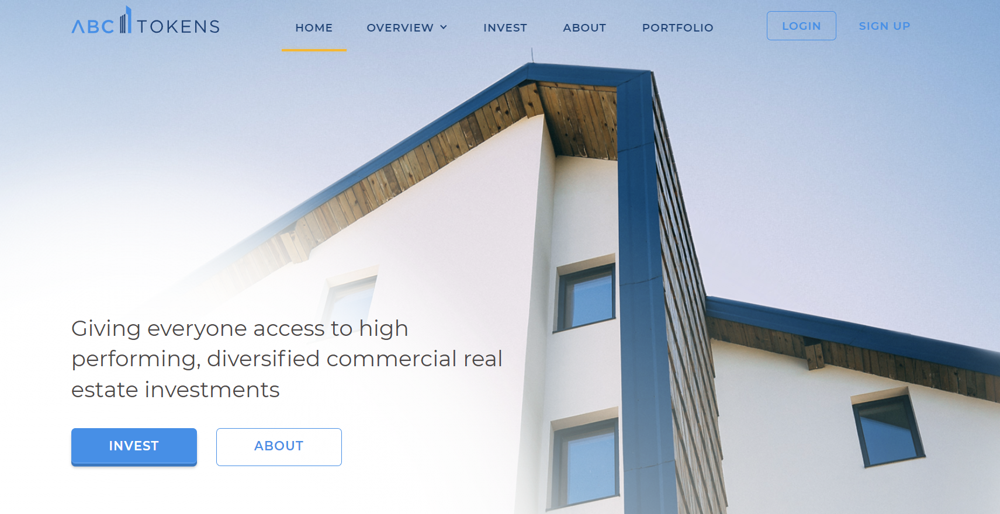

#ABC Tokens
Promo website dedicated to Investing in real estate with the help of a blockchain

## Demo
http://axure.stage.sharp-dev.net/abc-tokens/

## Setup
Download or clone repo.\
\
Run `npm install` in the project root folder to install dependencies

## Available Scripts
In the project directory, you can run:

### `npm run start`

Runs the app in the development mode.\
Open [http://localhost:3000](http://localhost:3000) to view it in your browser.

### `npm run build`

Builds the app for production to the `build` folder.

## Technologies

## Assembly automation

